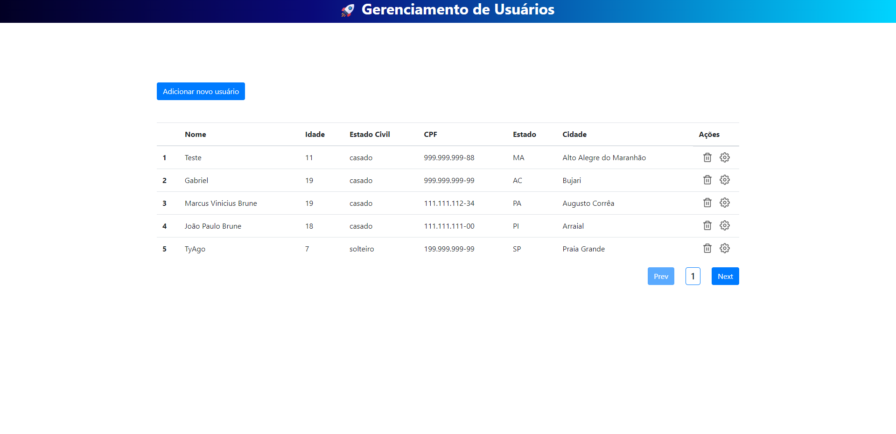

<h1 align="center">
    :rocket: Gerenciamento de Usuários
</h1>

<p align="center"> 
  Eu desenvolvi essa plataforma para melhorar minhas habilidades no Front End/Back End,
  é possível inserir novos usuários, apagar, atualizar e também desenvolvi uma paginação nos dados,
  pois quando lidamos com muitos dados e pegamos todos de uma vez temos uma queda de performance,
  o indicado é paginar os dados para não ser necessário trazer todos de uma vez.
</p>

## :computer: Aplicação

### Home

<p align="center">
    
</p>

## :bulb: Funcionalidades

* Criar novos usuários;

* Deletar usuários;

* Atualizar usuários;

* Listar usuários com paginação.

## :wrench: Pré-requisitos

 Antes de começar, você vai precisar ter instalado em sua máquina as seguintes ferramentas:
[Git](https://git-scm.com) e o [Node.js](https://nodejs.org/en/). 
Além disto é bom ter um editor para trabalhar com o código como o [VSCode](https://code.visualstudio.com/)

## :rocket: Para rodar a aplicação

```bash

# Clone este repositório
$ git clone https://github.com/Joaobru/UserManagement.git

# Acesse a pasta do projeto no seu terminal/cmd
$ cd UserManagement

# Execute o comando nas pastas server/web para instalar todas as dependências
$ npm install ou yarn

# Adicione os dados do banco de dados no server/ormconfig.json

# Execute a aplicação em modo de desenvolvimento, é importante executar este
# comando primeiro no server depois no web
$ npm start ou yarn start

# A aplicação será aberta na porta:3000 - acesse http://localhost:3000

```

## 🛠 Tecnologias

  * [Node.js](https://nodejs.org/en/) + [TypeScript](https://www.typescriptlang.org/) (Back-End);

  * [ReactJS](https://reactjs.org/) + [TypeScript](https://www.typescriptlang.org/) (Front-End);

  * [PostgreSQL](https://www.postgresql.org/) (Banco de Dados);

  * [TypeORM](https://typeorm.io/) (Conexão com o Banco de Dados);


